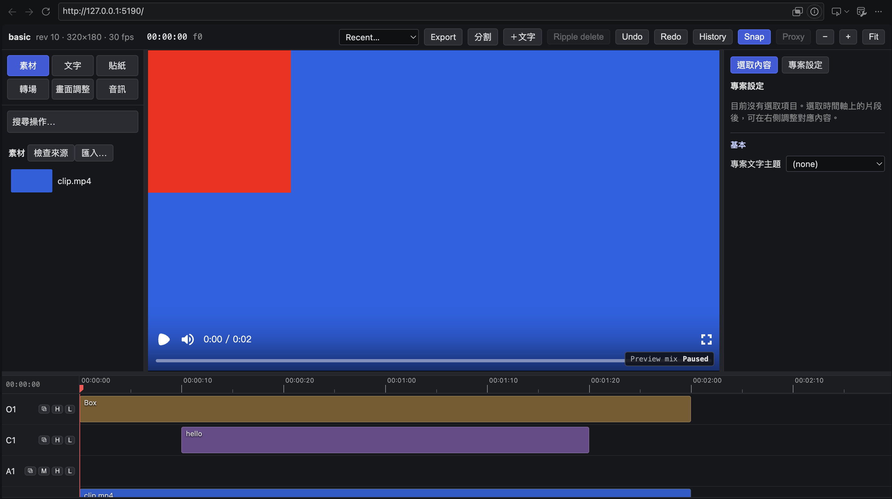

# Splicewright

A video editor that an AI agent and a person can work on at the same time. The edit is a single
`project.json`. An agent changes it through MCP tools, you change it in a browser timeline, and
Remotion renders it. Both sides use the same operations, so every change can be undone, is checked
before it is saved, and appears live on the other side.



The data model, the list of operations and the design decisions are in [SPEC.md](SPEC.md). This
file covers installing and using the editor.

## Install

Requirements:

- Node 26 or later. It runs the TypeScript sources directly, so there is no build step.
- `ffmpeg` and `ffprobe` on your `PATH`.
- Python 3, only if you want transcripts and beat detection. The other ingest steps run without it.
- Python 3.10–3.12, only if you want local Kokoro text-to-speech. Kokoro setup is independent of `ingest/.venv`.

```sh
git clone https://github.com/Cedric-Kuo-0712/splicewright.git splicewright && cd splicewright
npm install
# Optional, for transcripts (faster-whisper) and beats (librosa):
python3 -m venv ingest/.venv && ingest/.venv/bin/pip install -r ingest/requirements.txt
# Optional, puts `splicewright` on your PATH:
(cd packages/cli && npm link)
```

Without `npm link`, run `node <repo>/packages/cli/src/main.ts <command>` wherever this manual says
`splicewright <command>`.

## Quick start

```sh
mkdir trip && cd trip
splicewright init --title "Trip" --fps 30 --size 1920x1080
cp ~/Movies/trip/*.mp4 raw/            # or: splicewright import ~/Movies/trip/*.mp4 (copies into raw/)
splicewright ingest                     # probes, proxies, thumbnails, waveforms, transcripts, beats
splicewright open                       # the editor, at http://127.0.0.1:5190
splicewright render --preset draft      # quick check → out/final.mp4
splicewright render                     # master quality
```

You can also skip the `cp`/`import` step and drop files onto the media bin or the timeline in the
editor. They are copied into `raw/` and ingested in the background.

Web imports probe metadata before responding, without waiting for unrelated background ingest.
Queued editing proxies, thumbnails, and waveforms run before reverse/analysis work; an ingest
already running finishes its current phase. All existing preparation steps still run, and a
proxy is reported ready only when its cache and output are available.

Ingest FFmpeg codec and filter pools default to `max(2, min(8, available CPU cores - 2))`
threads, or one thread on a single-core host. This is a per-pool ceiling, not a total CPU limit;
the separate ingest `jobs` option still controls concurrent work. For calibration, set
`SPLICEWRIGHT_FFMPEG_THREADS` to an integer from 1 to 32. Proxy resolution, source FPS, GOP,
and quality settings are unchanged. The optional `scripts/benchmark-ingest.mjs` runner records
real import API/proxy/background timings or an ingest workload in a fresh experiment folder.

## Export encoders and timeline memory

The Export menu offers Draft, H.264 CPU, H.264 Hardware, and H.265 Hardware in one list.
CPU remains the default. CLI/MCP use the same renderer; pass `--preset h264-cpu`,
`--preset h264-hardware`, or `--preset h265-hardware`. Existing `draft`, `master`, and
project presets remain available. Hardware modes require an available encoder and report an
error rather than silently falling back: VideoToolbox on macOS, or NVENC on supported
Linux/Windows NVIDIA installations. WSL GPU availability must be verified in that environment.

Hardware presets use bitrate instead of CRF. Initial targets are 20 Mbps for H.264 and 12 Mbps
for H.265 at 1920x1080/30fps, scaled by output pixels (including preset `scale`) and FPS and rounded to whole
Mbps with a 1 Mbps floor. They are starting points, not a guarantee of equivalent visual quality.
Override `videoBitrate` in the matching project preset to calibrate; HEVC MP4 uses `hvc1`.
With the current Remotion version, H.265 with AAC accepts `.mp4`, `.mkv`, or `.hevc`; `.mov` is unsupported.
The optional `scripts/benchmark-export.mjs <repo> <input-video> <fresh-output-dir>` compares
three actual exports of the same two-second 720p composition with text, recording encoder args,
versions, hashes, render time, file size, and full-decode checks. Its single-run timings do not
establish a performance or quality winner.

Timeline clips mount only around the horizontal viewport, with 640px overscan. Active pointer
captures, drag groups, and caption editors stay mounted. Long audio canvases cover only the
visible segment with 256px overscan; beat guides/ticks and keyframe marks are windowed too.
Waveform request cache retains at most 32 entries and retries failed loads. Full project data,
track rows, and selection stay intact; this reduces mounted DOM/canvas work, not project data
size or a guaranteed percentage of browser heap. Scroll/drag feel remains browser validation.

## Offline narration

Kokoro runs locally through ONNX Runtime's CPU provider. Install only the languages you need; US
and UK English share a model, while Mandarin uses a separate model. Model setup is explicit and
downloads into `~/.splicewright/tts` (override with `SPLICEWRIGHT_TTS_HOME`); generation does not
access the network. Python 3.10–3.12 is required for setup.

```sh
splicewright tts status
splicewright tts setup --language en-us       # or en-gb, zh, or en-us,zh
splicewright tts generate --text "Welcome to the trip." --language en-us --voice af_heart --at 0
```

`tts generate` creates and imports a WAV, then inserts it on an unlocked audio track in one
revision and one undo step. English voices: `af_heart`, `am_adam`, `bf_emma`, `bm_george`. Mandarin
voices: `zf_001`, `zm_010`. Agents can use the MCP tools `tts_status` and `tts_generate`; model
installation stays in the CLI.

## Source installation

After checking out this repository, run the installer from its root. It requires Node.js 26 or later
and installs the editor dependencies with `npm ci`. The wizard checks for Git, `ffmpeg`,
`ffprobe`, and a compatible Python when TTS is selected, and offers package-manager installation when supported. On Linux it installs OS packages
only when run with the needed administrator privileges; otherwise install Git and FFmpeg with your
distribution package manager and rerun.

```sh
node scripts/install.mjs
```

BreezyVoice model files and the bundled micromamba archive use repository-pinned versions and
SHA-256 checks. Setup verifies downloads before extraction or publishing; synthesis verifies
every model file before loading it. Unchanged files use an installation receipt for status
queries. Setup and generation cannot overlap for the same TTS engine.

Choose `none`, `kokoro`, `breezyvoice`, or both when prompted. It downloads only the selected TTS
runtime and models. Kokoro's default is US English; select the desired `en-us`, `en-gb`, or `zh`
languages in the wizard. For automation, make the selection explicit:

```sh
node scripts/install.mjs --tts kokoro --languages en-us,zh --yes
node scripts/install.mjs --tts breezyvoice --yes
node scripts/install.mjs --tts kokoro,breezyvoice --languages en-us,zh --yes
node scripts/install.mjs --tts none --yes
```

The installer records its state and streamed log under `~/.splicewright/install/`. Each chosen TTS
engine is set up through the same CLI command used after installation, then checked for ready status
and the selected Kokoro languages. BreezyVoice setup uses a local Python 3.10 environment and pinned
source checkout under `~/.splicewright/breezyvoice`; it needs at least 8 GiB free disk space. It
supports macOS and Linux/WSL2. Native Windows BreezyVoice setup is unsupported because its
`pynini` dependency is unavailable there; install it from WSL2. On Apple Silicon, setup uses the
MPS-compatible flow path while keeping LLM and HiFT on CPU.

After installation, create or open a project and start the editor:

```sh
mkdir trip && cd trip
node <repo>/packages/cli/src/main.ts init --title "Trip"
node <repo>/packages/cli/src/main.ts open
```

`<repo>` is the absolute path of your checkout. On Windows, run the BreezyVoice installer and
editor together inside WSL2 (Ubuntu 24.04 provides Python 3.12). Open the editor's localhost URL
in the Windows browser. Native Windows can install the editor and Kokoro without BreezyVoice.
This is a source installer, not a published npm package or packaged desktop application.

The editor's **Audio → Narration** panel selects Kokoro or BreezyVoice and installs a missing
engine explicitly. BreezyVoice reference recordings and exact transcripts are stored as named
profiles, shared by the editor, CLI, and MCP. Upload once, then select the saved voice; recordings
must be 3–30 seconds and browser uploads are limited to 20 MB. Mandarin narration is limited to
300 characters per generation. Generated audio is imported and inserted with one undo step.

```sh
splicewright tts status --engine breezyvoice
splicewright tts setup --engine breezyvoice
splicewright tts voice-add --name "My voice" --audio ~/voice.m4a --transcript-file ~/voice.txt
splicewright tts voices
splicewright tts generate --engine breezyvoice --voice-id <saved-id> --text "歡迎來到我的旅行日記。" --at 0
```

Without `npm link`, substitute `node <repo>/packages/cli/src/main.ts` for `splicewright`.
Agents use `tts_status`, `tts_setup`, `tts_voice_list`, `tts_voice_register`, `tts_voice_delete`,
and `tts_generate`. Keep existing Kokoro calls unchanged; for cloning, pass `engine: "breezyvoice"`
and `voiceId`. Setup and BreezyVoice generation return a `jobId` immediately; inspect
`tts_job_status` for completion and the insertion result. Jobs belong to the current MCP server
session. Setup prepares pronunciation/tokenizer assets; generation is offline and never downloads
models. The `SPLICEWRIGHT_BREEZYVOICE_HOME` variable changes the runtime/profile location.

## Working with an agent

`init` writes three files alongside `project.json`:

| File | What it's for |
|---|---|
| `AGENTS.md` | The brief (goal, length, style, what to keep), the agent's workflow, and a Notes section where the agent keeps decisions between sessions. **Fill in the Brief before the first session.** |
| `CLAUDE.md` | Points Claude Code at `AGENTS.md`. |
| `.mcp.json` | Starts `splicewright mcp` in this folder, so the agent gets the editing tools. |

To start a session, open Claude Code (or any other MCP client) in the project folder and keep
`splicewright open` running so you can watch. Things you can ask for:

- "Make a 60-second rough cut of the best moments. Put the talking head on V1 and B-roll over it."
- "Cut the ums and the long pauses from talk.mp4."
- "Add captions from the transcript and fix any misheard names."
- "Put song.m4a under everything, and cut the photo slideshow to its beats."
- "Look at 0:40–0:55 and tell me what's there before you change anything."

How you and the agent share the project:

- Every agent step appears in your timeline right away, and each step is one entry in **History**.
  - Undo works the same way for both of you, and the agent is told to undo only its own last step.
- If you edit while the agent is working, its next write is rejected because it is out of date. The
  agent then re-reads the project instead of overwriting your change.
- You can point the agent at a spot in the edit.
  - Markers and the I/O range are part of the project, so the agent can see them.
  - The I/O range is also kept in the URL, so you can paste the link into the chat.
- Anything worth remembering, such as a chosen take or a rejected idea, goes under **Notes** in
  `AGENTS.md`.

## The editor

The screen has four areas: the media bin on the left, the player in the middle, the inspector on
the right, and the timeline along the bottom. Right-click almost anything (items, empty lanes, the
ruler, markers, track headers, media) to get a menu of the actions available for it.

### Timeline

- **Adding media.** Drag a clip from the bin onto a track. Dropping it below the last track creates
  a new track.
  - To swap the media of a clip that is already placed, use the bin menu's **Replace selected clip**.
- **Moving and trimming.** Drag an item to move it, or drag its edges to trim.
  - If several items are selected, dragging one of them moves them all in time.
  - Drag on an empty lane to draw a selection box: Shift adds to the selection, ⌘ toggles items.
- **Magnetic tracks (⧉).** On a magnetic track, removing something closes the gap it leaves, and
  inserting something pushes the later items along. Turn it off on overlay tracks where you want
  gaps to stay.
- **Slip.** Alt-drag a video item to change which part of the source it shows, without moving it on
  the timeline. The player shows the new first frame while you drag.
- **Captions and overlays** are attached to the video item under them and move with it.
  - Alt-drag a caption or overlay to attach it to a different video item.
  - Double-click a caption to edit its text.
- **Fades and volume.** Hover over an audio or video item to show its fade handles and its volume
  line, then drag them.
- **Transitions.** Right-click the first of two touching clips, then pick Dissolve, Dip to black or
  Wipe into the next clip.
  - Dissolve and wipe need extra source media past the cut on both sides. If there isn't enough, the
    editor tells you.
- **Speed.** Item menu → **Speed…**, or the inspector. The same source range plays faster or slower,
  and the clip gets shorter or longer to match.
- **Freeze frame.** Press ⇧F. The frame at the playhead becomes a 2-second still, inserted into the
  clip at that point.
- **Tracks.**
  - Double-click a track's name to rename it; drag its header to reorder.
  - The header buttons are M (mute), H (hide) and L (lock).
  - Use the +V / +A / +C / +O row to add a video, audio, caption or overlay track.
  - A caption track's menu has **Export SRT**.

### Keyboard

| Keys | Action |
|---|---|
| Space · J / K / L | Play/pause · shuttle backward / stop / forward (press again to go faster) |
| ← / → · ⇧← / ⇧→ | Step 1 frame · step 10 frames |
| ↑ / ↓ · ⇧↑ / ⇧↓ | Previous/next edit or marker · also stop at beats and captions |
| Home / End · `[` / `]` | Start/end of the timeline · start/end of the selected clip |
| S or ⌘B | Split at the playhead |
| ⌫ · ⇧⌫ | Delete · ripple delete |
| ⌘C / ⌘V / ⌘⇧V / ⌘D | Copy · paste at the playhead · paste and push later items along · duplicate |
| ⌘A · Esc | Select all · clear the selection (and leave crop mode) |
| `,` / `.` (⇧ for 10) | Nudge the selection by 1 frame (10 with ⇧) |
| ⌥, / ⌥. | Slip the selection by one frame |
| I / O · ⌥X · `/` | Set in/out · clear the range · loop the range |
| M · ⌥M · ⇧M | Add a marker · remove the marker at the playhead · add a range marker around the selection |
| B | Tap a beat on the selected audio item |
| ⇧F | Freeze frame |
| ⇧C | Crop mode on the player |
| N | Snapping on/off |
| + / − · ⇧Z | Zoom in/out · fit the whole timeline |
| ⌘Z / ⌘⇧Z | Undo / redo (the History button lists every step) |

When an I/O range is set and nothing is selected, the range acts as the selection:

- **Split** cuts at both ends of the range.
- ⌫ lifts the range out and leaves a gap; ⇧⌫ extracts it and closes the gap.
- **Fit to beats** is limited to the range.

### Player: position, scale, rotation, crop

- **Transform box.** Select one video item and put the playhead over it. A box appears on the
  player:
  - drag inside the box to move the picture (it snaps to the centre; hold Alt to stop snapping);
  - drag a corner to scale;
  - drag the knob above the box to rotate (hold Shift to step by 15°);
  - double-click to reset.
- **Crop.** Press ⇧C, or click **crop → on preview** in the inspector. The box now shows crop
  edges:
  - drag an edge to crop that side;
  - double-click to remove the crop;
  - press Esc to leave crop mode.

  Crop sides always refer to the picture's own top, right, bottom and left, even when the picture
  is rotated.

### Inspector: effects, looks, keyframes

Select an item to see its fields.

- **Effects.** Brightness, contrast, saturation, hue, blur, grayscale, sepia and invert are sliders.
  - The player updates while you drag, and letting go saves the change as a single undo step.
  - Double-click a slider to reset it.
- **Look ▾.** Applies a preset: B&W, Noir, Warm, Cool, Vintage, Vivid or Faded. The preset replaces
  the item's current effects, and you can then adjust the sliders from there.
- **Crop sliders.** Set each side precisely, as a fraction of the picture.
- **Keyframes** (◇ / ◆) are available on volume, x, y, scale, rotation, opacity and every effect.
  1. Move the playhead to where the change should start, then click ◇ next to the field. That
     records the current value as a keyframe.
  2. Move the playhead to where the change should end, and change the value using the field, the
     slider or the box on the player. Once a property has keyframes, any edit you make to it adds
     or updates a keyframe at the playhead.
  3. ◆ means there is a keyframe at the playhead; click it to remove that keyframe.
  4. Keyframes show as small diamonds on the timeline item. Click a diamond to jump to it.

  Keyframes are stored against the clip's own media, not its position on the timeline. So they stay
  with the same moment of footage when you trim, split, slip or change the speed.
- **Audio items** have a beats section:
  - **Detect beats** finds the beats; B taps one in by hand at the playhead.
  - **Fit to beats** re-cuts a magnetic video track so its clips change on the beats.

### Proxies

The **Proxy** toggle plays lightweight edit proxies in the player so playback stays smooth. It has
no effect on renders, which always use the original files.

## Rendering

```sh
splicewright still --at 00:12.5            # one frame → out/still-<frame>.jpg
splicewright render --preset draft          # half resolution, fast
splicewright render --range 300-900 -o out/part.mp4
splicewright render                         # master: full resolution, crf 18
```

You can add your own presets and Remotion components in `splicewright.config.ts`. See
[SPEC.md §9](SPEC.md) and `examples/basic`.

## Command reference

Every command prints one JSON object. On error it exits with status 1.

```
splicewright init [--title T] [--fps 30] [--size 1920x1080]
splicewright import <paths...> [--no-ingest]
splicewright ingest [--only proxy,reverse,analysis,thumbs,waveform,transcript,beats] [--jobs N]
splicewright status
splicewright op <opName> '<json args>' [--base <revision>]
splicewright undo | redo [--base <revision>]
splicewright still --at <frame|[hh:]mm:ss[.s]> [-o file.jpg]
splicewright render [-o out/final.mp4] [--preset draft|master] [--range a-b]
splicewright open [--port 5190]
splicewright mcp
splicewright migrate video-cut <path> [--out <dir>] [--force]
```

`op` gives you every edit the agent has, from a script. Example:
`splicewright op setKeyframe '{"itemId":"i_4","prop":"opacity","at":40,"value":0}'`. The
operations are listed in [SPEC.md §5](SPEC.md).

## Track synchronization

Track synchronization is opt-in. In the track controls, choose **同步主軌** to let a track follow a magnetic video track, or **固定時間（不跟隨）** to keep independent timing. Existing projects keep their current behavior. This synchronizes downstream ripple movement; it does not attach arbitrary audio to a particular shot or automatically align edits to music beats.

Ripple edits on the primary track move eligible free items on linked tracks by the same frame delta. Source-anchored captions and attached overlays retain their anchor behavior and do not move twice. A free item crossing the edit boundary is ambiguous and refuses the edit; split it or remove the link explicitly first. Locked affected tracks, invalid links, and invalid overlaps also refuse the entire edit. A continuous background song can stay unlinked while a later scene-specific music track follows the scene.

CLI and MCP share the core rules. Set track `syncTo` with `setTrack`; set it to `null` to detach. Use the read-only MCP `preview_edit` tool or CLI `preview-edit '<ops-json-array>' --base <revision>` to inspect direct and secondary movements. Preview does not reserve the project: the approved write must use the same revision and will fail if another edit intervenes. UI edits on linked projects preview cross-track movements before committing.

## Project folder

```
project.json          the edit; change it only through the editor, the CLI or the agent
raw/                  source media; never modified
out/                  renders and stills
AGENTS.md CLAUDE.md .mcp.json    agent brief and wiring (from init)
splicewright.config.ts           optional: custom components and render presets
.splicewright/        analysis caches, undo history, and saved material reviews; preserve reviews/history
```

Material observations are saved in `.splicewright/material-reviews.json`, tied to the source content version. Optional planning fields record story roles, tags, suitable uses, inspected source ranges, and cautions. `prepare_materials` also caches timestamp candidates from JPEG EXIF `DateTimeOriginal`, media container creation tags, and common dated filenames. Container creation is not proof of recording time; filenames are inferred, unknown timezones stay unknown, and missing metadata is `null`. Filesystem modification/creation times are not used as recording-time fallbacks.

For a small agent overview, use `list_materials` with `view: "compact"`; use `paths` and `view: "full"` to expand chosen sources. The compact view omits detailed ranges and flags truncated summaries. Source hashing still checks the inventory. Parallel readers should return bounded observations to one coordinator, which saves them through `record_material_review`; do not overwrite the shared JSON directly. Derived analysis caches can be rebuilt, but deleting saved reviews loses these observations.

## Troubleshooting

- **"conflict" on an edit.** Someone else, you or the agent, changed the project first. The editor
  reloads by itself; the agent re-reads the project before it decides what to do next.
- **No transcript or beats.** Check that the Python virtual environment from Install exists, or set
  `SPLICEWRIGHT_PYTHON` to an interpreter that has `faster-whisper` and `librosa` installed. Then
  run `splicewright ingest --only transcript,beats`.
- **Crop or the transform box looks misaligned on a clip.** Ingest that asset so its pixel size is
  known. Until then, the editor assumes the picture fills the frame.

## License

Splicewright's own code is released under the [MIT License](LICENSE).

**Remotion is not covered by this license.** Splicewright depends on
[Remotion](https://www.remotion.dev), which is source-available under its own
[license](https://remotion.dev/license). It is free for individuals, for-profit organizations with up
to 3 employees, and non-profits. Larger for-profit organizations need a Remotion Company License.
Remotion is installed from npm, not copied into this repository, and the MIT license here grants no
rights to it. Check that you are eligible before you use Splicewright.

## Third-party software

- **Remotion** (`remotion`, `@remotion/*`): rendering and the in-browser player. Remotion License, see above.
- **Other npm dependencies** (React, Vite, zod, `@modelcontextprotocol/sdk`, and so on) are installed
  from npm under their own licenses, mostly MIT, Apache-2.0, ISC and BSD. `@fontsource/*` fonts are OFL-1.1.
- **Color LUTs** in `packages/core/assets/luts/`: MIT, with the license texts beside the files
  (`film/LICENSE.txt`, João Almeida; `native/LICENSE`, Nixua). The film LUTs are converted from the
  `t3mujinpack` pack (the source images are not included here). Camera and film-stock names such as Kodak and Fuji
  are trademarks of their owners and only describe the look.
- **BreezyVoice** (optional TTS), [mtkresearch/BreezyVoice](https://github.com/mtkresearch/BreezyVoice):
  Apache-2.0, and the model weights on Hugging Face are also tagged Apache-2.0. They are downloaded at
  setup, not shipped here. `ingest/breezyvoice-mps.patch` modifies a file taken from CosyVoice
  ([FunAudioLLM/CosyVoice](https://github.com/FunAudioLLM/CosyVoice), Apache-2.0) as vendored in
  BreezyVoice. The patch is applied to the downloaded checkout and stays under that license.
- **Kokoro** (optional TTS), `faster-whisper` and `librosa` (optional ingest) are downloaded or
  installed by their own tooling. Check their licenses and model terms before you redistribute anything
  generated with them.
